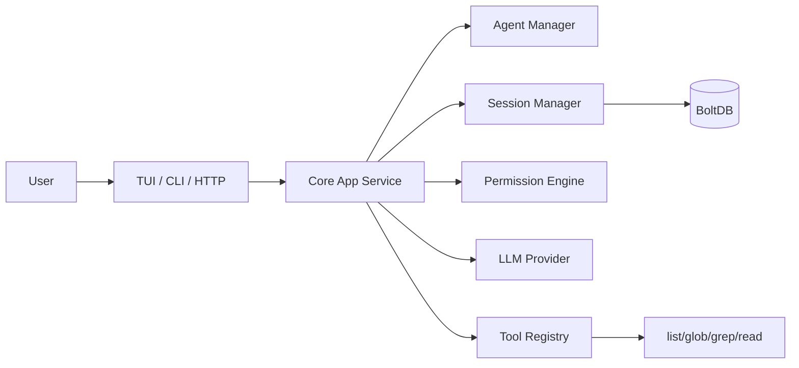

# OpenCode-style Agent Architecture

## Logic flow

1. load config + AGENTS.md rules
2. select agent (`build` / `plan` / `@agent`)
3. assemble context (turns + summary + pinned facts + rules)
4. call LLM with tool schema contract
5. permission check on each tool call (`allow/ask/deny`)
6. write tool result back into messages
7. repeat until final or request timeout/cancel
8. persist turn/audit and trigger compaction when needed
